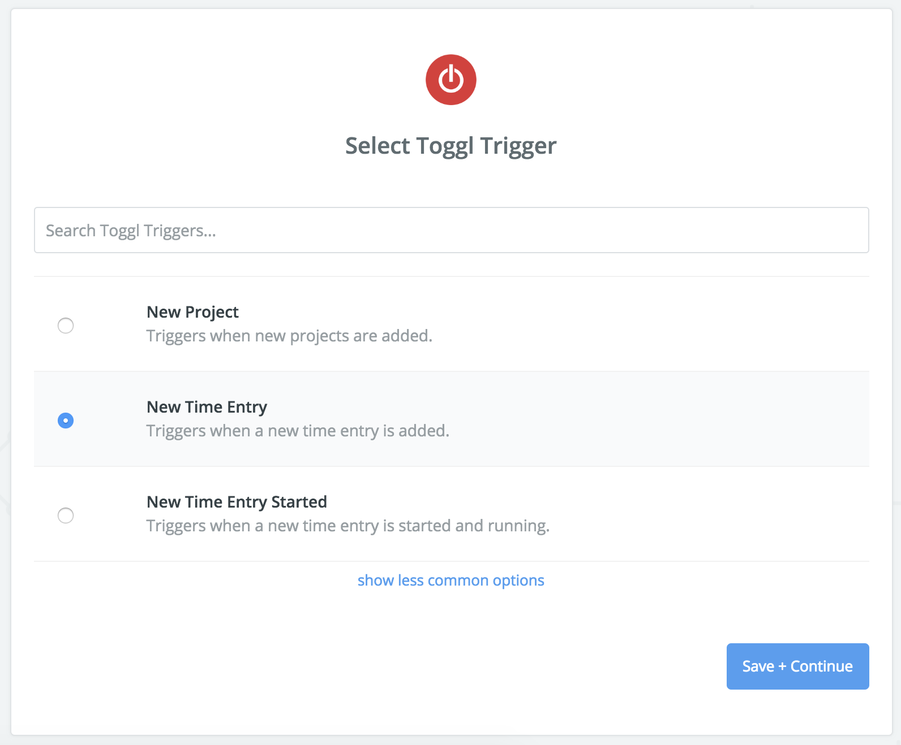
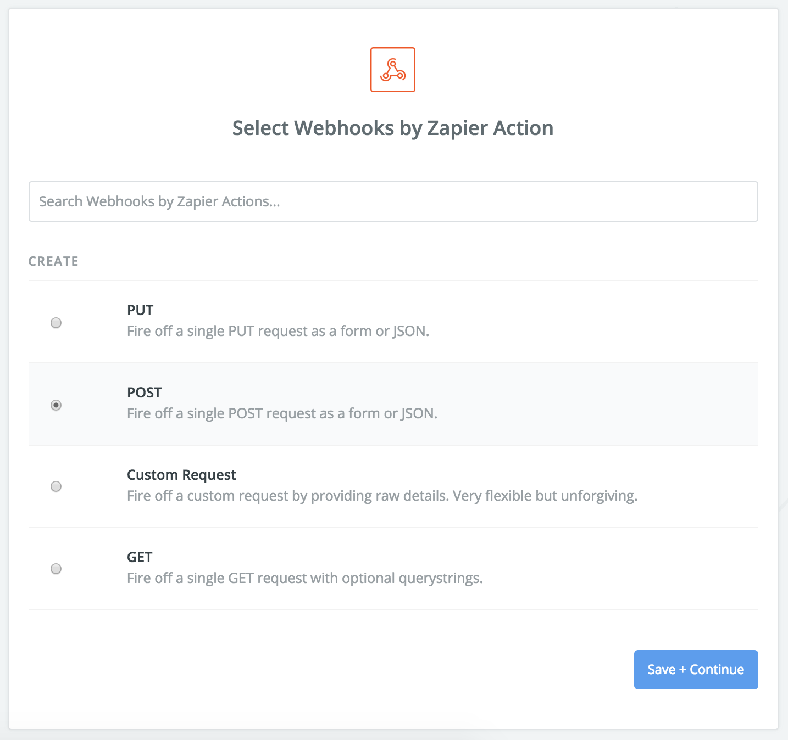
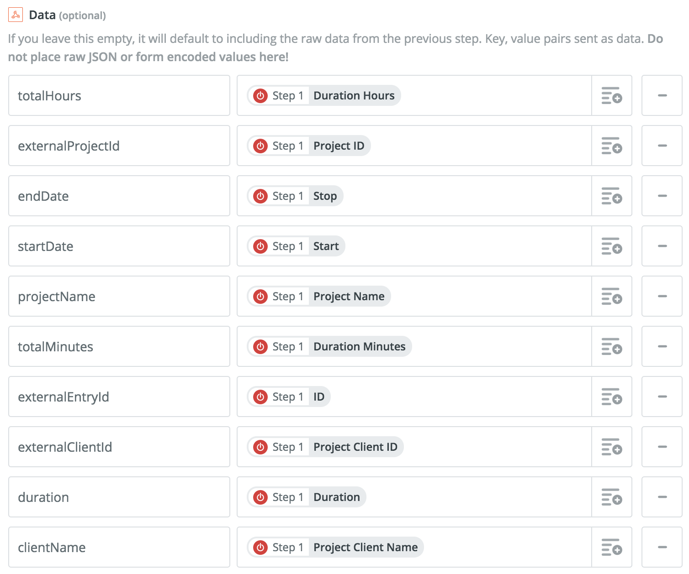

<h1 align="center">TogglBill</h1>
<p align="center" style="vertical-align:middle"><sup>Supercharge</sup> <svg style="width:100px" xmlns="http://www.w3.org/2000/svg" viewBox="0 0 240 72.1"><path d="M234.9 57.6c-3.5 0-5.2-2.5-5.2-7.5V14.7c0-5.1 1.6-7.5 5.2-7.5s5.1 2.5 5.1 7.5v35.4c0 5-1.6 7.5-5.1 7.5zm-30.8 14.5c-9.5 0-15.2-3.5-15.2-7.5a4.4 4.4 0 0 1 4.2-4.5h.3c2.6 0 5.7 2.8 11.1 2.8s8.1-3.1 8.1-8.7c0-.4-.1-.8-.1-1.3a10.8 10.8 0 0 1-9.4 4.9c-8.2 0-15-7.5-15-18s7.3-18.3 16.1-18.3a10.1 10.1 0 0 1 8.3 3.7 5.6 5.6 0 0 1 4.6-3.3c3.5 0 5.2 2.4 5.2 7.5v20.7c0 6.2-.4 11-2.4 14.3-3.1 5-8.5 7.7-15.8 7.7zm1.5-40.9c-3.8 0-6.8 3.3-6.8 8.5s2.9 8.7 6.8 8.7 6.8-3.4 6.8-8.7-3-8.5-6.8-8.5zm-40.8 40.9c-9.5 0-15.2-3.5-15.2-7.5a4.4 4.4 0 0 1 4.2-4.5h.3c2.6 0 5.7 2.8 11.1 2.8s8.1-3.1 8.1-8.7c0-.4-.1-.8-.1-1.3a10.8 10.8 0 0 1-9.4 4.9c-8.1 0-15-7.5-15-18s7.3-18.3 16.1-18.3a10.1 10.1 0 0 1 8.3 3.7 5.6 5.6 0 0 1 4.6-3.3c3.5 0 5.2 2.4 5.2 7.5v20.7c0 6.2-.4 11-2.4 14.3-3 5-8.4 7.7-15.8 7.7zm1.5-40.9c-3.8 0-6.8 3.3-6.8 8.5s2.9 8.7 6.8 8.7 6.8-3.4 6.8-8.7-3-8.5-6.8-8.5zm-38.1 27c-10.2 0-17.5-7.7-17.5-18.5s7.4-18.5 17.5-18.5 17.5 7.7 17.5 18.5-7.2 18.5-17.4 18.5zm0-27.3c-3.8 0-6.8 3.3-6.8 8.7s2.9 8.8 6.8 8.8 6.8-3.4 6.8-8.8-3-8.7-6.8-8.7zm-24.1.9h-.9v18.3c0 5-1.6 7.5-5.1 7.5S93 55.1 93 50.1V31.8h-.4c-3.7 0-5.8-1.8-5.8-4.5s2.1-4.4 6.2-4.6v-4.5c0-5 1.6-7.5 5.2-7.5s5.1 2.5 5.1 7.5v4.5h.9c4.1 0 6.5 1.8 6.5 4.6s-2.2 4.5-6.6 4.5z"></path><circle cx="35.6" cy="35.6" r="35.6" fill="#e1393f"></circle><path d="M38 14.1h-5v25h5zm-2.5 40A17.5 17.5 0 0 1 31 19.7v5.2a12.5 12.5 0 1 0 9 0v-5.2a17.5 17.5 0 0 1-4.5 34.4z" fill="#fff"></path></svg> <sup>&trade;</sup></p>


<br />
<br />


<small style="float: right">Generated with: <a href="http://magicmockups.com/" target="_blank" rel="noopener">Unsplash</a></small>

<br />
<br />


## About

TogglBill is a platform extension for [Toggl](https://toggl.com/) that keeps track of billing and payments.


----

To configure TogglBill to receive your tasks from Toggl, you will need to set a [Zapier](https://zapier.com/) rule.

1. Go to [Zapier](https://zapier.com/) and create a new Zap.
2. Use 'New Time Entry' from Toggl for the trigger.



3. Connect your account, select a workspace, and pull a sample.
4. Use Zapier's 'Webhook Action' for the action.
5. Select the option to fire a POST request.



6. Use the following fields:

**URL**:

Use `<DOMAIN OF YOUR TogglBill DEPLOYMENT>/api/entries`

If you delpoyed TogglBill in https://cool-app.herokuapp.com, the URL to use would be: https://cool-app.herokuapp.com/api/entries

**Payload Type**:

Use the `Json` payload.

**Data**:

The value on the left is the value you should use as key (without the colon `:`). The values on the right are the names of the Toggl variables to use.

```
totalHours: Duration Hours
externalProjectId: Project ID
endDate: Stop
startDate: Start
projectName: Project Name
totalMinutes: Duration Minutes
externalEntryId: ID
externalClientId: Project Client ID
duration: Duration
clientName: Project Client Name
```



7. Submit your Zap, test it, give it a name, and activate it.


## Setup

1. **Install Meteor**

    On Linux & Mac:

    ```sh
    > curl https://install.meteor.com/ | sh
    ```

    This will setup [Meteor](http://github.com/meteor/meteor) (including [Node](https://github.com/nodejs/node) and [Mongo](https://github.com/mongodb/mongo) if necessary).

    > _Note:_ Windows users must [download installer](https://www.meteor.com/install).

2. **Clone Repository**

    ```sh
    > git clone https://github.com/juangesino/toggl-bill.git
    > cd toggl-bill
    ```

3. **Install Dependencies**

    If you have npm installed:

    ```sh
    > npm install
    ```

    If you only have meteor:

    ```sh
    > meteor npm install
    ```

4. **Run**

    While in repository directory run:

    ```sh
    > meteor run
    ```

    Load browser and go to [http://localhost:3000/](http://localhost:3000/)


## Deploy

### Heroku

Follow <a href="https://medium.com/@leonardykris/how-to-run-a-meteor-js-application-on-heroku-in-10-steps-7aceb12de234#.lmg8s462o" target="_blank">these</a> steps to deploy the Meteor app on Heroku.

## Contributing

1. Fork it ( https://github.com/juangesino/toggl-bill/fork )
2. Create your feature branch (`git checkout -b my-new-feature`)
3. Commit your changes (`git commit -am 'Add some feature'`)
4. Push to the branch (`git push origin my-new-feature`)
5. Create a new Pull Request

## License

See [MIT-LICENSE](https://github.com/juangesino/toggl-bill/blob/master/LICENSE.md).
