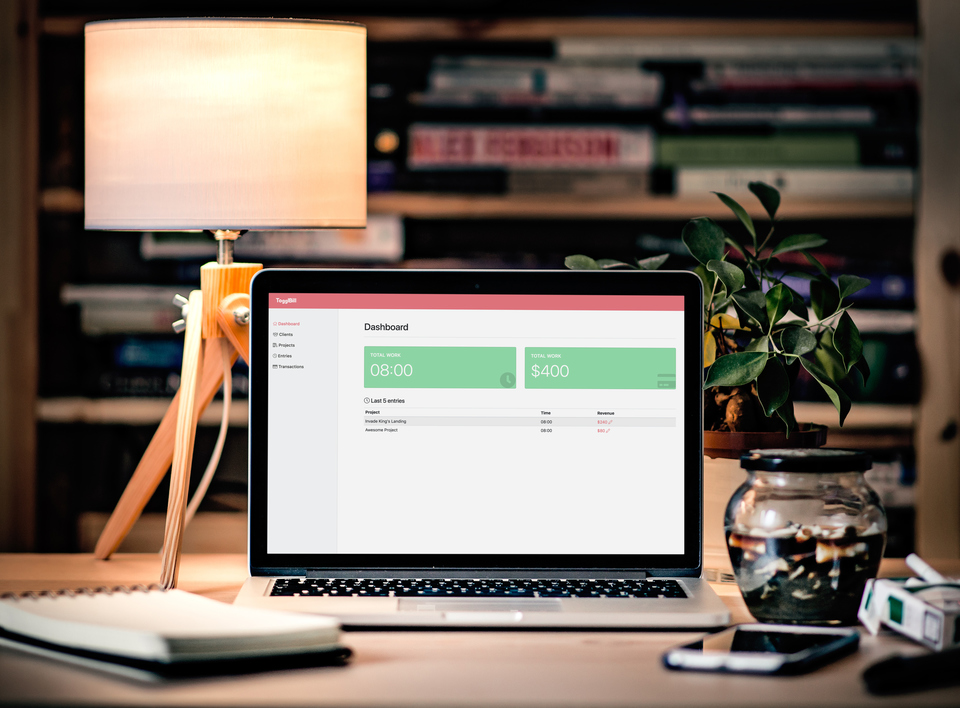

<h1 align="center">TogglBill</h1>
<p align="center" style="vertical-align:middle"><sup>Supercharge</sup>  <sup>&trade;</sup></p>


<br />
<br />


<small style="float: right">Generated with: <a href="http://magicmockups.com/" target="_blank" rel="noopener">Unsplash</a></small>

<br />
<br />


## About

TogglBill is a platform extension for [Toggl](https://toggl.com/) that keeps track of billing and payments.


----

To configure TogglBill to receive your tasks from Toggl, you will need to set a [Zapier](https://zapier.com/) rule.

1. Go to [Zapier](https://zapier.com/) and create a new Zap.
2. Use 'New Time Entry' from Toggl for the trigger.


3. Connect your account, select a workspace, and pull a sample.
4. Use Zapier's 'Webhook Action' for the action.
5. Select the option to fire a POST request.


6. Use the following fields:

**URL**:

Use `<DOMAIN OF YOUR TogglBill DEPLOYMENT>/api/entries`

If you delpoyed TogglBill in https://cool-app.herokuapp.com, the URL to use would be: https://cool-app.herokuapp.com/api/entries

**Payload Type**:

Use the `Json` payload.

**Data**:

The value on the left is the value you should use as key (without the colon `:`). The values on the right are the names of the Toggl variables to use.

```
totalHours: Duration Hours
externalProjectId: Project ID
endDate: Stop
startDate: Start
projectName: Project Name
totalMinutes: Duration Minutes
externalEntryId: ID
externalClientId: Project Client ID
duration: Duration
clientName: Project Client Name
```


7. Submit your Zap, test it, give it a name, and activate it.


## Setup

1. **Install Meteor**

    On Linux & Mac:

    ```sh
    > curl https://install.meteor.com/ | sh
    ```

    This will setup [Meteor](http://github.com/meteor/meteor) (including [Node](https://github.com/nodejs/node) and [Mongo](https://github.com/mongodb/mongo) if necessary).

    > _Note:_ Windows users must [download installer](https://www.meteor.com/install).

2. **Clone Repository**

    ```sh
    > git clone https://github.com/juangesino/toggl-bill.git
    > cd toggl-bill
    ```

3. **Install Dependencies**

    If you have npm installed:

    ```sh
    > npm install
    ```

    If you only have meteor:

    ```sh
    > meteor npm install
    ```

4. **Run**

    While in repository directory run:

    ```sh
    > meteor run
    ```

    Load browser and go to [http://localhost:3000/](http://localhost:3000/)


## Deploy

### Heroku

Follow <a href="https://medium.com/@leonardykris/how-to-run-a-meteor-js-application-on-heroku-in-10-steps-7aceb12de234#.lmg8s462o" target="_blank">these</a> steps to deploy the Meteor app on Heroku.

## Contributing

1. Fork it ( https://github.com/juangesino/toggl-bill/fork )
2. Create your feature branch (`git checkout -b my-new-feature`)
3. Commit your changes (`git commit -am 'Add some feature'`)
4. Push to the branch (`git push origin my-new-feature`)
5. Create a new Pull Request

## License

See [MIT-LICENSE](https://github.com/juangesino/toggl-bill/blob/master/LICENSE.md).
